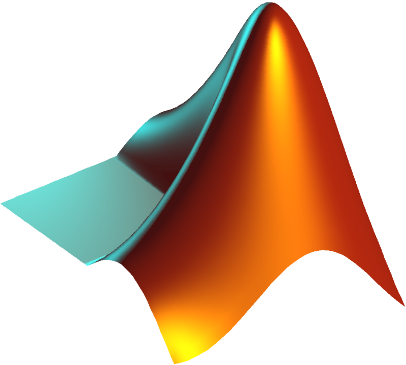

Hello and welcome! I'm Nikita Sehrawat, a final-year dual degree student looking for PhD opportunities in astrodyanmics and satellite mission design. I am majoring in Aerospace engineering at Indian Institute of Technology Kharagpur. My research interests are:
- MutiBody Dynamical systems
- Space Mission Design, Trajectory Optimization, Dynamics around Small Bodies
- Spacecraft Attitude Determination and Control, Satellite Constellations
- Space Situational Awareness, Space Debris Removal and Collision Avoidance

You can find me [here](https://swtnikita50.github.io/nikitasehrawat.github.io//).

In my spare time, I enjoy vibing to hiphop music and dancing my heart out. I also enjoy sports, particularly volleyball and badminton. One not-so-fun fact about me is that I can enjoy even the most tedious task of running. My logo design, animation, and web development skills are at the intersection of my creative and technical sides and you can find some examples of those in my [manim-mycodes](https://github.com/swtnikita50/manim-mycodes) repo and on my [website](https://swtnikita50.github.io/nikitasehrawat.github.io/).

## Technical Skills
              

## Contact Me

@mail: nikita99.iitkgp@gmail.com
@LinkedIn: https://www.linkedin.com/in/nikita-sehrawat-438b01144/
<!---

swtnikita50/swtnikita50 is a ✨ special ✨ repository because its `README.md` (this file) appears on your GitHub profile.
You can click the Preview link to take a look at your changes.
--->
